# SUTURA — Entity Relationship Diagram (ERD)

This document contains the visual ERD (Mermaid) and the canonical SQL schema for SUTURA, fully normalized and matching the `prisma/schema.prisma`.

## 1. Visual ERD (Mermaid)

```mermaid
erDiagram
    %% Core Identity & Tenant
    USERS ||--o{ SHOPS : owns
    SUBSCRIPTIONS ||--o| SHOPS : activates
    SHOPS ||--o{ SHOP_BRANCHES : has
    SUBSCRIPTIONS ||--o{ SUBSCRIPTION_LOGS : tracks
    SHOPS ||--o{ TENANT_SUSPENSION_LOGS : tracked_in
    SHOPS ||--o{ GARMENT_TEMPLATES : defines
    SHOPS ||--o{ PRODUCTION_SPECIALIZATIONS : defines
    
    %% Multi-branch staff
    SHOP_BRANCHES ||--o{ BRANCH_MEMBERS : assigns
    USERS ||--o{ BRANCH_MEMBERS : joins
    BRANCH_MEMBERS ||--o{ BRANCH_PERMISSIONS : has
    
    %% Customer & Measurement
    SHOPS ||--o{ CUSTOMERS : serves
    USERS ||--o| CUSTOMERS : links
    CUSTOMERS ||--o{ CUSTOMER_MEASUREMENTS : has
    CUSTOMER_MEASUREMENTS ||--o{ CUSTOMER_MEASUREMENTS : supersedes
    CUSTOMER_MEASUREMENTS ||--o{ MEASUREMENT_VALUES : contains
    
    %% Appointments & Fittings
    CUSTOMERS ||--o{ APPOINTMENTS : books
    SHOP_BRANCHES ||--o{ APPOINTMENTS : hosts
    USERS ||--o{ APPOINTMENTS : assigned_to
    APPOINTMENTS ||--o{ FITTING_SESSIONS : triggers
    ORDERS ||--o{ FITTING_SESSIONS : has_fittings
    
    %% Production Workflow
    CUSTOMERS ||--o{ ORDERS : places
    SHOP_BRANCHES ||--o{ ORDERS : processes
    USERS ||--o{ ORDERS : created_by
    APPOINTMENTS ||--o| ORDERS : generates
    CUSTOMER_MEASUREMENTS ||--o{ ORDERS : measurement_source
    ORDERS ||--o{ ORDER_ITEMS : contains
    GARMENT_TEMPLATES ||--o{ ORDER_ITEMS : basis_for
    ORDERS ||--o{ PRODUCTION_TASKS : has_steps
    PRODUCTION_SPECIALIZATIONS ||--o{ PRODUCTION_TASKS : categorizes
    ORDERS ||--o{ ORDER_STATUS_HISTORY : tracks
    ORDERS ||--o{ ORDER_INSPECTIONS : quality_check
    ORDERS ||--o| ORDER_COST_SHEETS : financial_breakdown
    ORDERS ||--o{ ALTERATION_DETAILS : tracks_changes
    ORDERS ||--o{ BULK_ORDER_MEMBERS : bulk_lineage
    ORDERS ||--o{ ORDER_SWATCHES : has
    ORDERS ||--o{ ORDER_DESIGN_ASSETS : has

    %% Billing & Payments
    ORDERS ||--|| INVOICES : billed_via
    INVOICES ||--o{ PAYMENTS : receives
    
    %% Inventory & Procurement
    SHOPS ||--o{ INVENTORY_ITEMS : catalog
    SHOP_BRANCHES ||--o{ BRANCH_INVENTORY : holds
    INVENTORY_ITEMS ||--o{ BRANCH_INVENTORY : allocated_to
    SHOP_BRANCHES ||--o{ INVENTORY_MOVEMENTS : logs
    INVENTORY_ITEMS ||--o{ INVENTORY_MOVEMENTS : tracked_by
    USERS ||--o{ INVENTORY_MOVEMENTS : moved_by
    ORDERS ||--o{ INVENTORY_RESERVATIONS : holds_stock
    
    %% Suppliers
    SHOPS ||--o{ SUPPLIERS : works_with
    SUPPLIERS ||--o{ SUPPLIER_ITEMS : provides
    INVENTORY_ITEMS ||--o{ SUPPLIER_ITEMS : sourced_from
    PURCHASE_ORDERS ||--o{ PURCHASE_ORDER_ITEMS : contains
    PURCHASE_ORDERS ||--o{ GOODS_RECEIPTS : fulfilled_by
    GOODS_RECEIPTS ||--o{ GOODS_RECEIPT_ITEMS : received_lineage
    USERS ||--o{ PURCHASE_ORDERS : requested_by



    %% Admin Governance
    SHOPS ||--o| TENANT_VERIFICATIONS : verified_by
    TENANT_VERIFICATIONS ||--o{ TENANT_VERIFICATION_HISTORY : tracks_audit
    USERS ||--o{ TENANT_VERIFICATION_HISTORY : admin_actions
    SUPPORT_TICKETS ||--o{ SUPPORT_TICKET_MESSAGES : threads
    USERS ||--o{ SUPPORT_TICKET_MESSAGES : sent_by
    SUPPORT_TICKET_MESSAGES ||--o{ SUPPORT_TICKET_ATTACHMENTS : contains
    SUPPORT_TICKET_CATEGORIES ||--o{ SUPPORT_TICKETS : classifies
    USERS ||--o{ AUDIT_LOGS : performs
```



## 2. SQL for draw.io (PostgreSQL)
Copy the block below and paste it into **draw.io → + (Insert) → Advanced → SQL**.

```sql
-- SUTURA ERP - Final Normalized Schema
-- PostgreSQL Syntax for draw.io SQL Import

CREATE TABLE users (
    id TEXT PRIMARY KEY,
    role TEXT NOT NULL DEFAULT 'CUSTOMER',
    name TEXT NOT NULL,
    email TEXT UNIQUE NOT NULL,
    password_hash TEXT NOT NULL,
    status TEXT DEFAULT 'ACTIVE',
    created_at TIMESTAMP DEFAULT CURRENT_TIMESTAMP
);

CREATE TABLE subscriptions (
    id TEXT PRIMARY KEY,
    plan_name TEXT NOT NULL,
    plan_level TEXT DEFAULT 'BASIC',
    status TEXT DEFAULT 'PENDING',
    max_branches INT NOT NULL,
    max_staff INT NOT NULL,
    start_date TIMESTAMP NOT NULL,
    end_date TIMESTAMP NOT NULL,
    price DECIMAL(10,2) NOT NULL
);

CREATE TABLE subscription_logs (
    id TEXT PRIMARY KEY,
    subscription_id TEXT REFERENCES subscriptions(id),
    action TEXT NOT NULL,
    notes TEXT,
    created_at TIMESTAMP DEFAULT CURRENT_TIMESTAMP
);

CREATE TABLE shops (
    id TEXT PRIMARY KEY,
    owner_user_id TEXT REFERENCES users(id),
    subscription_id TEXT UNIQUE REFERENCES subscriptions(id),
    shop_name TEXT NOT NULL,
    business_name TEXT NOT NULL,
    business_type TEXT NOT NULL,
    status TEXT DEFAULT 'PENDING',
    created_at TIMESTAMP DEFAULT CURRENT_TIMESTAMP
);

CREATE TABLE shop_branches (
    id TEXT PRIMARY KEY,
    shop_id TEXT REFERENCES shops(id),
    branch_name TEXT NOT NULL,
    branch_code TEXT UNIQUE NOT NULL,
    address TEXT NOT NULL,
    contact_no TEXT NOT NULL,
    is_main BOOLEAN DEFAULT FALSE,
    branch_type TEXT DEFAULT 'RETAIL', -- RETAIL, PRODUCTION, WAREHOUSE, OFFICE
    manager_user_id TEXT,
    status TEXT DEFAULT 'ACTIVE',
    created_at TIMESTAMP DEFAULT CURRENT_TIMESTAMP
);

CREATE TABLE branch_members (
    id TEXT PRIMARY KEY,
    branch_id TEXT REFERENCES shop_branches(id),
    user_id TEXT REFERENCES users(id),
    branch_role TEXT NOT NULL,
    status BOOLEAN DEFAULT TRUE,
    assigned_at TIMESTAMP DEFAULT CURRENT_TIMESTAMP
);

CREATE TABLE branch_permissions (
    id TEXT PRIMARY KEY,
    branch_member_id TEXT REFERENCES branch_members(id),
    permission_code TEXT NOT NULL,
    can_view BOOLEAN DEFAULT FALSE,
    can_create BOOLEAN DEFAULT FALSE,
    can_update BOOLEAN DEFAULT FALSE,
    can_delete BOOLEAN DEFAULT FALSE
);

CREATE TABLE customers (
    id TEXT PRIMARY KEY,
    shop_id TEXT REFERENCES shops(id),
    user_id TEXT UNIQUE REFERENCES users(id), -- nullable if walk-in, but unique if linked
    full_name TEXT NOT NULL,
    email TEXT,
    phone TEXT NOT NULL,
    address TEXT,
    status BOOLEAN DEFAULT TRUE,
    created_at TIMESTAMP DEFAULT CURRENT_TIMESTAMP
);

CREATE TABLE customer_measurements (
    id TEXT PRIMARY KEY,
    customer_id TEXT REFERENCES customers(id),
    branch_id TEXT REFERENCES shop_branches(id),
    recorded_by_user_id TEXT REFERENCES users(id),
    recorded_at TIMESTAMP DEFAULT CURRENT_TIMESTAMP,
    parent_profile_id TEXT REFERENCES customer_measurements(id),
    garment_category TEXT, -- e.g. Upper Body, Lower Body
    garment_type TEXT, -- e.g. Suit, Pants
    status TEXT DEFAULT 'DRAFT',
    version_no INT DEFAULT 1,
    is_current BOOLEAN DEFAULT TRUE
);

CREATE TABLE measurement_values (
    id TEXT PRIMARY KEY,
    profile_id TEXT REFERENCES customer_measurements(id),
    field_name TEXT NOT NULL,
    value_inches DECIMAL(5,2),
    value_cm DECIMAL(5,2)
);

CREATE TABLE appointments (
    id TEXT PRIMARY KEY,
    shop_id TEXT REFERENCES shops(id),
    branch_id TEXT REFERENCES shop_branches(id),
    customer_id TEXT REFERENCES customers(id),
    assigned_staff_id TEXT REFERENCES users(id),
    appointment_type TEXT NOT NULL, -- CONSULTATION, MEASUREMENT, FITTING, PICKUP, ALTERATION
    status TEXT NOT NULL, -- SCHEDULED, CONFIRMED, COMPLETED, CANCELLED, NO_SHOW
    date TIMESTAMP NOT NULL,
    start_time TEXT NOT NULL,
    duration_minutes INT NOT NULL,
    order_id TEXT,
    notes TEXT,
    created_at TIMESTAMP DEFAULT CURRENT_TIMESTAMP
);

CREATE TABLE orders (
    id TEXT PRIMARY KEY,
    shop_id TEXT REFERENCES shops(id),
    branch_id TEXT REFERENCES shop_branches(id),
    customer_id TEXT REFERENCES customers(id),
    created_by_user_id TEXT REFERENCES users(id),
    assigned_staff_id TEXT REFERENCES users(id),
    order_type TEXT DEFAULT 'BESPOKE',
    source_type TEXT DEFAULT 'WALK_IN',
    status TEXT DEFAULT 'DRAFT',
    total_amount DECIMAL(10,2) NOT NULL,
    due_date TIMESTAMP NOT NULL,
    appointment_id TEXT REFERENCES appointments(id),
    measurement_profile_id TEXT REFERENCES customer_measurements(id),
    created_at TIMESTAMP DEFAULT CURRENT_TIMESTAMP
);

CREATE TABLE order_cost_sheets (
    id TEXT PRIMARY KEY,
    order_id TEXT UNIQUE REFERENCES orders(id),
    base_cost DECIMAL(10,2) NOT NULL,
    labor_cost DECIMAL(10,2) NOT NULL,
    material_cost DECIMAL(10,2) NOT NULL,
    rush_fee DECIMAL(10,2) DEFAULT 0,
    customization_fee DECIMAL(10,2) DEFAULT 0,
    discount_amount DECIMAL(10,2) DEFAULT 0,
    estimated_total DECIMAL(10,2) NOT NULL,
    actual_total DECIMAL(10,2)
);

CREATE TABLE garment_templates (
    id TEXT PRIMARY KEY,
    shop_id TEXT REFERENCES shops(id),
    name TEXT NOT NULL,
    base_price DECIMAL(10,2) NOT NULL,
    description TEXT,
    category TEXT,
    is_active BOOLEAN DEFAULT TRUE
);

CREATE TABLE order_items (
    id TEXT PRIMARY KEY,
    order_id TEXT REFERENCES orders(id),
    garment_template_id TEXT REFERENCES garment_templates(id),
    garment_name TEXT NOT NULL,
    quantity INT NOT NULL,
    unit_price DECIMAL(10,2) NOT NULL,
    notes TEXT
);

CREATE TABLE production_specializations (
    id TEXT PRIMARY KEY,
    shop_id TEXT REFERENCES shops(id),
    name TEXT NOT NULL -- Cutting, Stitching, QC
);

CREATE TABLE production_tasks (
    id TEXT PRIMARY KEY,
    order_id TEXT REFERENCES orders(id),
    task_name TEXT NOT NULL,
    specialization_id TEXT REFERENCES production_specializations(id),
    assigned_to_user_id TEXT REFERENCES users(id),
    status TEXT DEFAULT 'PENDING',
    started_at TIMESTAMP,
    completed_at TIMESTAMP,
    notes TEXT
);

CREATE TABLE order_status_history (
    id TEXT PRIMARY KEY,
    order_id TEXT REFERENCES orders(id),
    status TEXT NOT NULL,
    changed_by_user_id TEXT REFERENCES users(id),
    changed_at TIMESTAMP DEFAULT CURRENT_TIMESTAMP,
    notes TEXT
);

CREATE TABLE order_inspections (
    id TEXT PRIMARY KEY,
    order_id TEXT REFERENCES orders(id),
    inspected_by_user_id TEXT REFERENCES users(id),
    status TEXT NOT NULL, -- PASS, FAIL
    findings TEXT,
    inspected_at TIMESTAMP DEFAULT CURRENT_TIMESTAMP
);

CREATE TABLE alteration_details (
    id TEXT PRIMARY KEY,
    order_id TEXT REFERENCES orders(id),
    description TEXT NOT NULL,
    difficulty_level TEXT,
    estimated_hours DECIMAL(4,2),
    completed_at TIMESTAMP
);

CREATE TABLE bulk_order_members (
    id TEXT PRIMARY KEY,
    order_id TEXT REFERENCES orders(id),
    customer_id TEXT REFERENCES customers(id),
    tag_name TEXT,
    size_code TEXT,
    measurement_profile_id TEXT REFERENCES customer_measurements(id)
);

CREATE TABLE order_swatches (
    id TEXT PRIMARY KEY,
    order_id TEXT REFERENCES orders(id),
    url TEXT NOT NULL,
    notes TEXT
);

CREATE TABLE order_design_assets (
    id TEXT PRIMARY KEY,
    order_id TEXT REFERENCES orders(id),
    asset_type TEXT NOT NULL, -- LOGO, SKETCH, REFERENCE
    url TEXT NOT NULL
);

CREATE TABLE fitting_sessions (
    id TEXT PRIMARY KEY,
    appointment_id TEXT REFERENCES appointments(id),
    order_id TEXT REFERENCES orders(id),
    measurement_profile_id TEXT NOT NULL REFERENCES customer_measurements(id),
    adjustment_notes TEXT,
    revision_no INT DEFAULT 1,
    next_fitting_date TIMESTAMP,
    created_at TIMESTAMP DEFAULT CURRENT_TIMESTAMP
);

CREATE TABLE invoices (
    id TEXT PRIMARY KEY,
    shop_id TEXT REFERENCES shops(id),
    branch_id TEXT REFERENCES shop_branches(id),
    order_id TEXT UNIQUE REFERENCES orders(id),
    invoice_no TEXT UNIQUE NOT NULL,
    subtotal DECIMAL(10,2) NOT NULL,
    discount DECIMAL(10,2) DEFAULT 0,
    tax DECIMAL(10,2) DEFAULT 0,
    total_amount DECIMAL(10,2) NOT NULL,
    status TEXT DEFAULT 'UNPAID',
    issued_at TIMESTAMP DEFAULT CURRENT_TIMESTAMP,
    due_date TIMESTAMP NOT NULL
);

CREATE TABLE payments (
    id TEXT PRIMARY KEY,
    invoice_id TEXT REFERENCES invoices(id),
    amount DECIMAL(10,2) NOT NULL,
    method TEXT NOT NULL,
    reference_no TEXT,
    status TEXT DEFAULT 'PENDING',
    paid_at TIMESTAMP DEFAULT CURRENT_TIMESTAMP,
    received_by_user_id TEXT REFERENCES users(id)
);

CREATE TABLE inventory_items (
    id TEXT PRIMARY KEY,
    shop_id TEXT REFERENCES shops(id),
    sku TEXT UNIQUE NOT NULL,
    item_name TEXT NOT NULL,
    category TEXT NOT NULL,
    unit TEXT NOT NULL,
    reorder_level DECIMAL(10,2) NOT NULL,
    status TEXT DEFAULT 'ACTIVE'
);

CREATE TABLE branch_inventory (
    id TEXT PRIMARY KEY,
    branch_id TEXT REFERENCES shop_branches(id),
    inventory_item_id TEXT REFERENCES inventory_items(id),
    on_hand_qty DECIMAL(10,2) NOT NULL,
    reserved_qty DECIMAL(10,2) NOT NULL,
    available_qty DECIMAL(10,2) NOT NULL,
    low_stock_flag BOOLEAN DEFAULT FALSE,
    last_updated TIMESTAMP DEFAULT CURRENT_TIMESTAMP,
    UNIQUE(branch_id, inventory_item_id)
);

CREATE TABLE inventory_movements (
    id TEXT PRIMARY KEY,
    branch_id TEXT REFERENCES shop_branches(id),
    inventory_item_id TEXT REFERENCES inventory_items(id),
    movement_type TEXT NOT NULL,
    quantity DECIMAL(10,2) NOT NULL,
    reference_type TEXT,
    reference_id TEXT,
    moved_by_user_id TEXT REFERENCES users(id),
    created_at TIMESTAMP DEFAULT CURRENT_TIMESTAMP,
    discrepancy_type TEXT -- DAMAGED, STOLEN, EXPIRED, MISCOUNT, RETURNED_TO_SUPPLIER
);

CREATE TABLE inventory_reservations (
    id TEXT PRIMARY KEY,
    order_id TEXT REFERENCES orders(id),
    inventory_item_id TEXT REFERENCES inventory_items(id),
    branch_id TEXT REFERENCES shop_branches(id),
    quantity DECIMAL(10,2) NOT NULL,
    status TEXT DEFAULT 'ACTIVE'
);

CREATE TABLE suppliers (
    id TEXT PRIMARY KEY,
    shop_id TEXT REFERENCES shops(id),
    supplier_name TEXT NOT NULL,
    contact_person TEXT,
    phone TEXT,
    email TEXT,
    address TEXT,
    status BOOLEAN DEFAULT TRUE
);

CREATE TABLE supplier_items (
    id TEXT PRIMARY KEY,
    supplier_id TEXT REFERENCES suppliers(id),
    inventory_item_id TEXT REFERENCES inventory_items(id),
    unit_cost DECIMAL(10,2) NOT NULL,
    moq DECIMAL(10,2),
    is_preferred BOOLEAN DEFAULT FALSE,
    lead_time_days INT
);

CREATE TABLE purchase_orders (
    id TEXT PRIMARY KEY,
    shop_id TEXT REFERENCES shops(id),
    branch_id TEXT REFERENCES shop_branches(id),
    supplier_id TEXT REFERENCES suppliers(id),
    requested_by_user_id TEXT REFERENCES users(id),
    status TEXT DEFAULT 'DRAFT',
    requested_at TIMESTAMP DEFAULT CURRENT_TIMESTAMP,
    bill_amount DECIMAL(10,2),
    amount_paid DECIMAL(10,2)
);

CREATE TABLE purchase_order_items (
    id TEXT PRIMARY KEY,
    purchase_order_id TEXT REFERENCES purchase_orders(id),
    inventory_item_id TEXT REFERENCES inventory_items(id),
    quantity DECIMAL(10,2) NOT NULL,
    unit_cost DECIMAL(10,2) NOT NULL,
    received_qty DECIMAL(10,2) DEFAULT 0
);

CREATE TABLE goods_receipts (
    id TEXT PRIMARY KEY,
    purchase_order_id TEXT REFERENCES purchase_orders(id),
    received_by_user_id TEXT REFERENCES users(id),
    received_at TIMESTAMP DEFAULT CURRENT_TIMESTAMP,
    reference_no TEXT
);

CREATE TABLE goods_receipt_items (
    id TEXT PRIMARY KEY,
    goods_receipt_id TEXT REFERENCES goods_receipts(id),
    inventory_item_id TEXT REFERENCES inventory_items(id),
    quantity_received DECIMAL(10,2) NOT NULL,
    condition_notes TEXT
);

CREATE TABLE stock_transfers (
    id TEXT PRIMARY KEY,
    source_branch_id TEXT REFERENCES shop_branches(id),
    dest_branch_id TEXT REFERENCES shop_branches(id),
    inventory_item_id TEXT REFERENCES inventory_items(id),
    quantity DECIMAL(10,2) NOT NULL,
    status TEXT DEFAULT 'REQUESTED',
    moved_by_user_id TEXT REFERENCES users(id),
    created_at TIMESTAMP DEFAULT CURRENT_TIMESTAMP
);


CREATE TABLE tenant_verifications (
    id TEXT PRIMARY KEY,
    shop_id TEXT UNIQUE REFERENCES shops(id),
    submitted_by_user_id TEXT NOT NULL,
    admin_reviewer_id TEXT,
    status TEXT DEFAULT 'PENDING',
    notes TEXT,
    verified_at TIMESTAMP
);

CREATE TABLE tenant_verification_history (
    id TEXT PRIMARY KEY,
    verification_id TEXT REFERENCES tenant_verifications(id),
    status TEXT NOT NULL,
    notes TEXT,
    actor_id TEXT REFERENCES users(id),
    created_at TIMESTAMP DEFAULT CURRENT_TIMESTAMP
);

CREATE TABLE tenant_suspension_logs (
    id TEXT PRIMARY KEY,
    shop_id TEXT REFERENCES shops(id),
    reason TEXT NOT NULL,
    actor_id TEXT REFERENCES users(id),
    created_at TIMESTAMP DEFAULT CURRENT_TIMESTAMP
);

CREATE TABLE support_ticket_categories (
    id TEXT PRIMARY KEY,
    name TEXT NOT NULL -- Billing, Technical, Feedback
);

CREATE TABLE support_tickets (
    id TEXT PRIMARY KEY,
    shop_id TEXT REFERENCES shops(id),
    user_id TEXT REFERENCES users(id),
    category_id TEXT REFERENCES support_ticket_categories(id),
    subject TEXT NOT NULL,
    status TEXT DEFAULT 'OPEN',
    priority TEXT DEFAULT 'NORMAL',
    created_at TIMESTAMP DEFAULT CURRENT_TIMESTAMP
);

CREATE TABLE support_ticket_messages (
    id TEXT PRIMARY KEY,
    ticket_id TEXT REFERENCES support_tickets(id),
    sender_user_id TEXT REFERENCES users(id),
    message TEXT NOT NULL,
    created_at TIMESTAMP DEFAULT CURRENT_TIMESTAMP
);

CREATE TABLE support_ticket_attachments (
    id TEXT PRIMARY KEY,
    message_id TEXT REFERENCES support_ticket_messages(id),
    url TEXT NOT NULL,
    file_type TEXT,
    file_size INT
);

CREATE TABLE audit_logs (
    id TEXT PRIMARY KEY,
    user_id TEXT REFERENCES users(id),
    action TEXT NOT NULL,
    module TEXT NOT NULL,
    entity_id TEXT,
    created_at TIMESTAMP DEFAULT CURRENT_TIMESTAMP
);

CREATE TABLE notifications (
    id TEXT PRIMARY KEY,
    user_id TEXT REFERENCES users(id),
    branch_id TEXT REFERENCES shop_branches(id),
    type TEXT NOT NULL,
    message TEXT NOT NULL,
    status TEXT DEFAULT 'UNREAD',
    scheduled_at TIMESTAMP,
    sent_at TIMESTAMP
);
```
