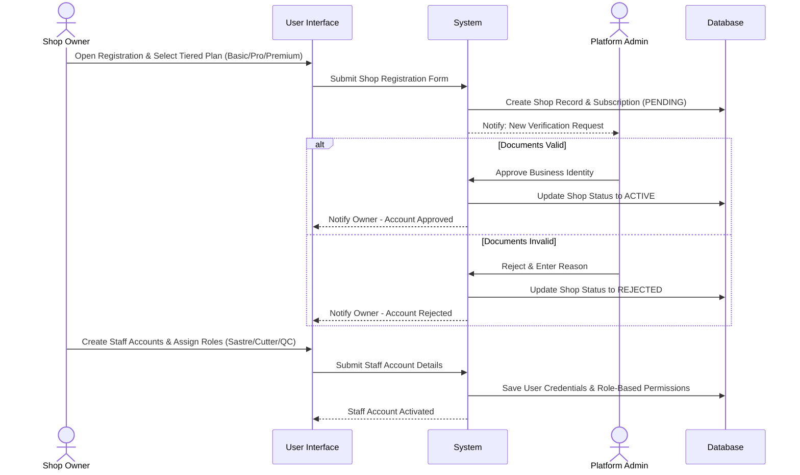
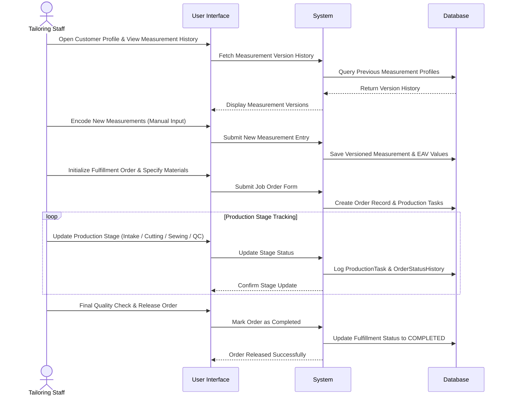
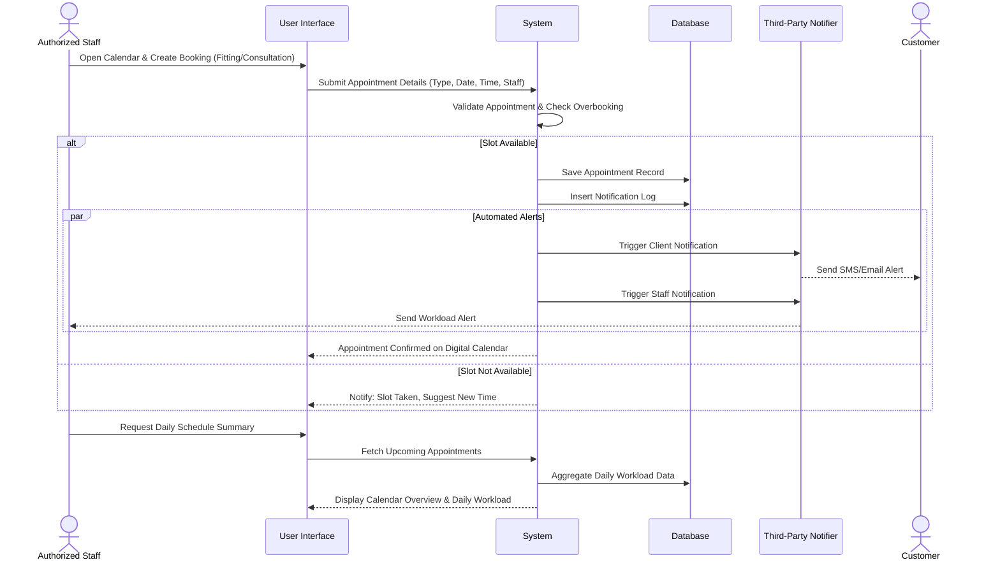
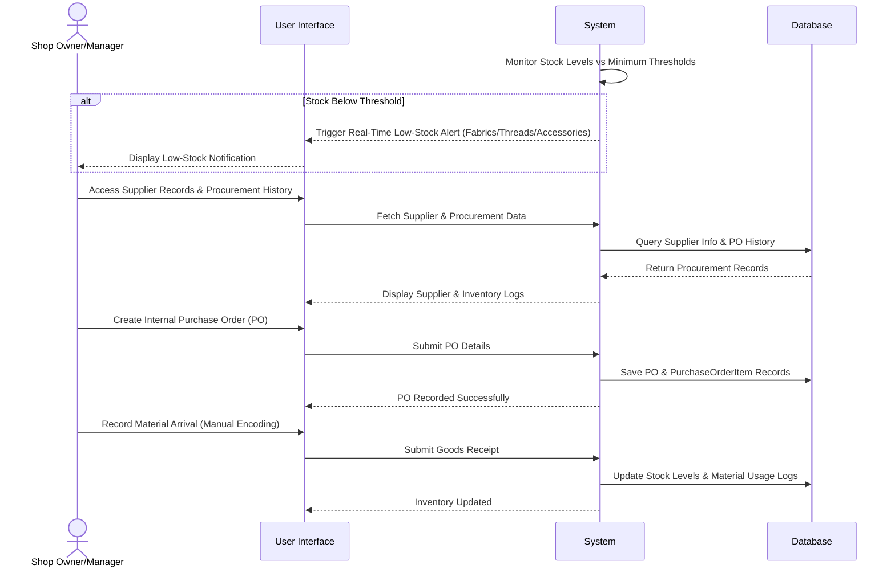
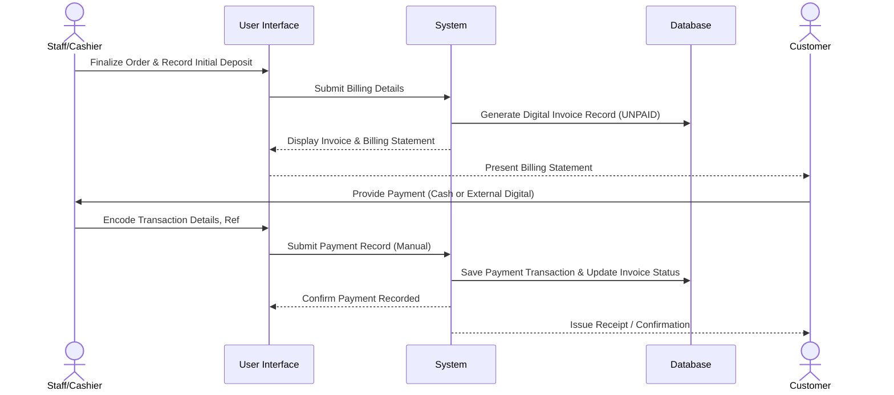
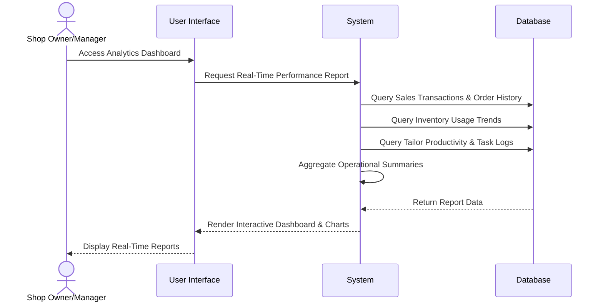

# SUTURA Sequence Diagrams

Operational flows for SUTURA. 1 Objective = 1 Figure. Mermaid-compatible.

---

## Objective 1: Subscription and Admin Module
**Goal:** To develop a Subscription and Admin Module for managing platform oversight, tiered service plans, role-based user accounts, and professional business profiles.

### Figure 1: Platform Administration, Shop Onboarding, and Role Management

---

## Objective 2: Customer Job and Fulfillment Order Module
**Goal:** To develop a Customer Job and Fulfillment Order Module for digitizing garment orders, tracking production stages, and managing measurement version history.

### Figure 2: Fulfillment Order Lifecycle and Production Stage Tracking

---

## Objective 3: Appointment Module
**Goal:** To develop an Appointment Module for scheduling fittings and consultations through a digital calendar with automated client and staff notifications.

### Figure 3: Digital Calendar Scheduling and Automated Notifications

---

## Objective 4: Inventory and Supplier Management Module
**Goal:** To develop an Inventory and Supplier Management Module for real-time stock monitoring of materials and maintaining internal procurement and supplier records.

### Figure 4: Real-Time Stock Monitoring and Internal Procurement Management

---

## Objective 5: Billing and Financial Tracking System
**Goal:** To develop a Billing and Financial Tracking System for recording transaction details and deposits to ensure accurate billing and financial transparency.

### Figure 5: Invoice Generation and Transaction Recording

---

## Objective 6: Centralized Analytics Dashboard
**Goal:** To implement a Centralized Analytics Dashboard for generating real-time reports on sales, inventory trends, and daily shop productivity.

### Figure 6: Centralized Operational Analytics and Reporting

