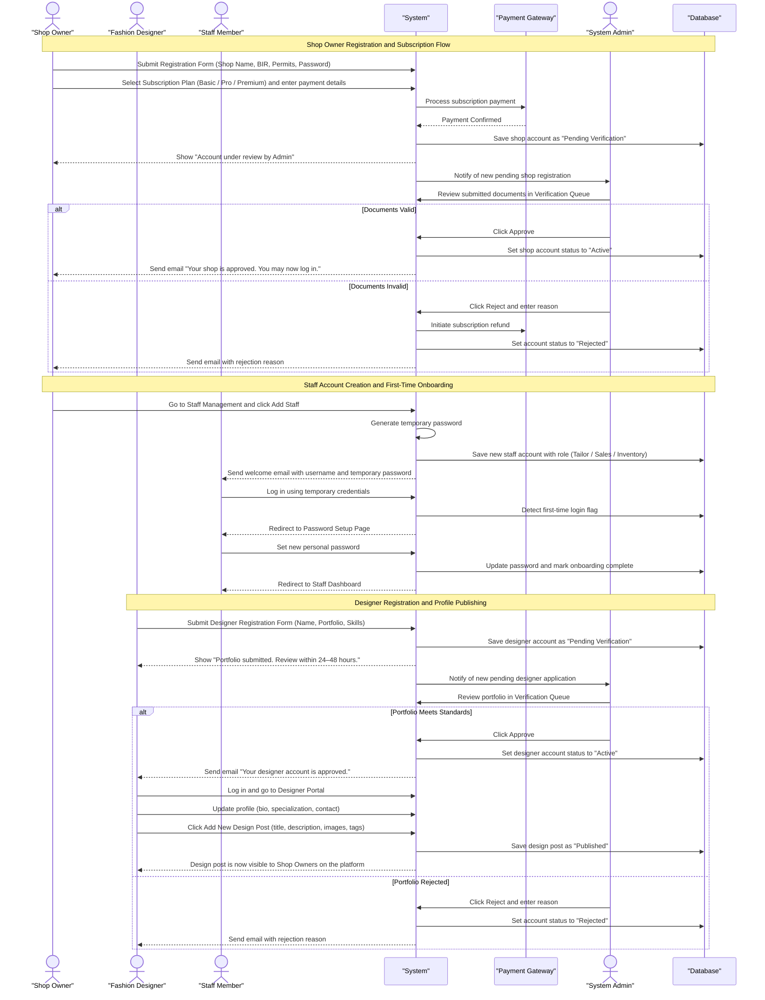
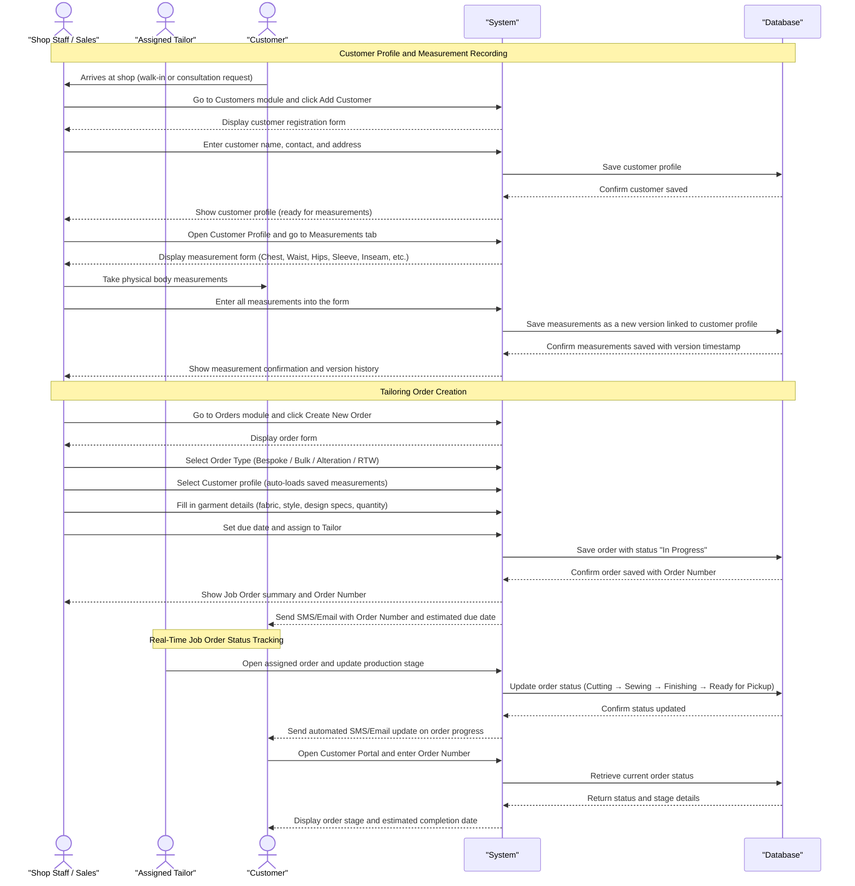
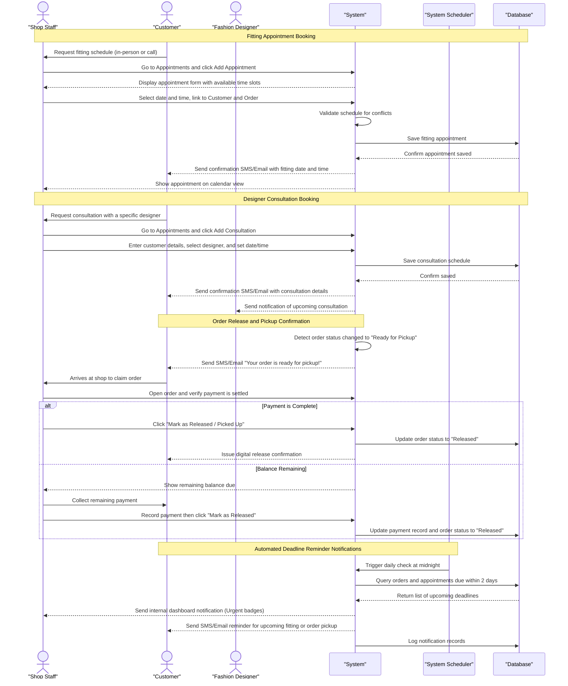
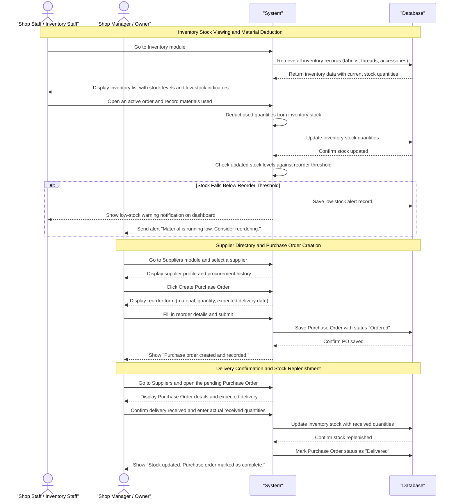
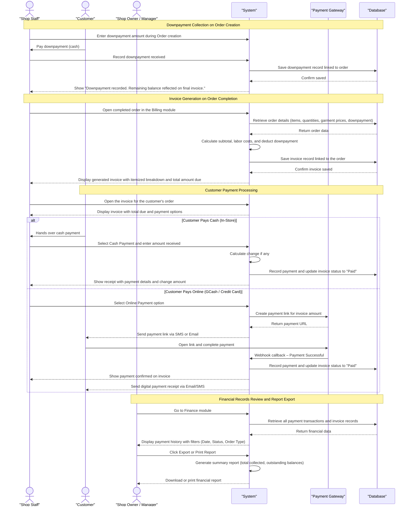
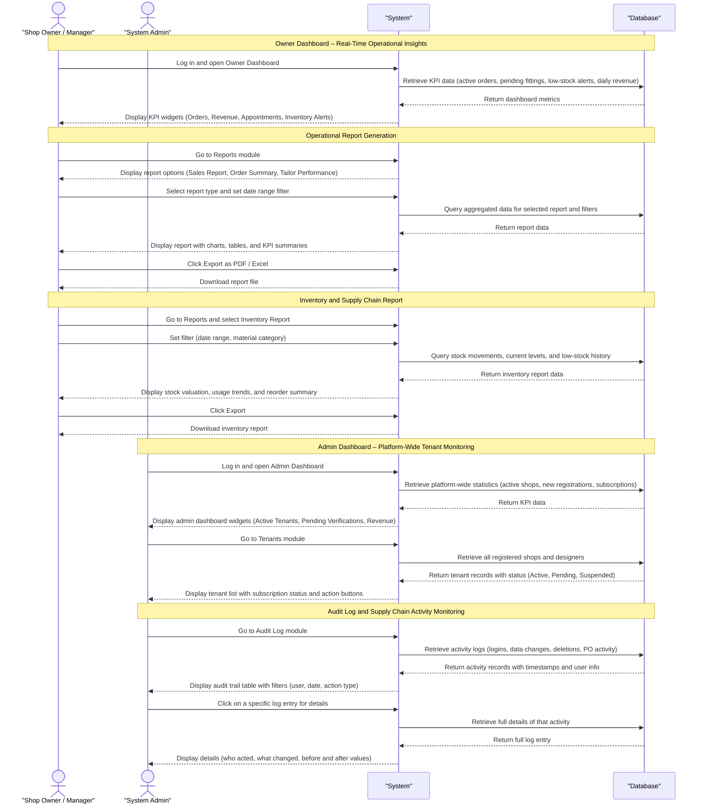

# SUTURA Sequence Diagrams

## Objective 1: Secure Registration, Subscription, and Role-Based User Management

To develop a secure registration and subscription module that enables tailoring businesses to manage role-based user accounts and allows fashion designers to curate profiles, showcase products, and publish design posts.

### Figure 1: Sequence Diagram – Registration, Subscription, and Role-Based Access

---

## Objective 2: Customer and Order Management System

To develop a comprehensive customer and order management system that stores body measurements with version history, digitizes the submission of tailoring requests, and tracks job order statuses in real time.

### Figure 2: Sequence Diagram – Customer Profile, Measurements, and Order Tracking

---

## Objective 3: Automated Scheduling and Notification Engine

To develop an automated scheduling and notification engine for fittings, consultations, and release dates that alerts both staff and clients of upcoming deadlines and order updates.

### Figure 3: Sequence Diagram – Appointment Scheduling, Release Confirmation, and Deadline Alerts

---

## Objective 4: Integrated Inventory and Supplier Management

To develop an integrated inventory and supplier management module that monitors material availability and facilitates seamless coordination with textile providers to streamline reordering and prevent production delays.

### Figure 4: Sequence Diagram – Inventory Monitoring, Low-Stock Alerts, and Supplier Reordering

---

## Objective 5: Financial Tracking and Digital Billing System

To develop a financial tracking system that automatically generates digital invoices and records payments to ensure billing accuracy and prevent deposit discrepancies.

### Figure 5: Sequence Diagram – Invoice Generation, Payment Processing, and Financial Records

---

## Objective 6: Analytics Dashboard and Reporting

To develop an analytics dashboard and reporting tool that provides real-time insights into shop operations, inventory trends, and overall supply chain activity for informed decision-making.

### Figure 6: Sequence Diagram – Analytics Dashboard, Report Generation, and Admin Monitoring

